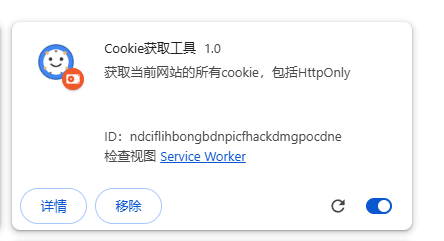
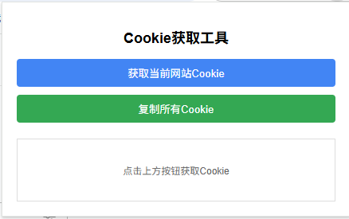
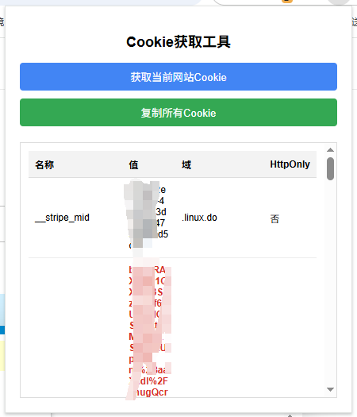

# Cookie 获取工具

这是一个 Chrome 浏览器扩展，可以获取当前网站的所有 cookie，包括 HttpOnly 标记的 cookie。

## 功能特点

- 获取当前网站的所有 cookie，包括 HttpOnly cookie
- 以表格形式清晰展示 cookie 信息
- 支持一键复制所有 cookie
- 支持所有网站

## 安装方法

1. 下载本仓库并解压
2. 打开 Chrome 浏览器，进入扩展管理页面：`chrome://extensions/`
3. 开启右上角的"开发者模式"
4. 点击左上角的"加载已解压的扩展程序"
5. 选择解压后的目录
6. 完成安装

## 使用方法

1. 访问你想要获取 cookie 的网站
2. 点击 Chrome 工具栏中的扩展图标
3. 在弹出窗口中点击"获取当前网站 Cookie"按钮
4. 查看获取到的 cookie 信息（HttpOnly cookie 会被高亮显示）
5. 如需复制所有 cookie，点击"复制所有 Cookie"按钮

## 隐私说明

- 本扩展仅在用户主动点击按钮时获取 cookie
- 所有 cookie 信息仅在本地展示，不会发送到任何远程服务器
- 本扩展不会在任何时候自动记录或存储 cookie 信息

## 注意事项

- 由于浏览器安全限制，某些网站可能会限制 cookie 的访问
- 本扩展仅适用于 Chrome 浏览器

## 软件截图

### 主界面

### Cookie 展示效果

### 复制功能

